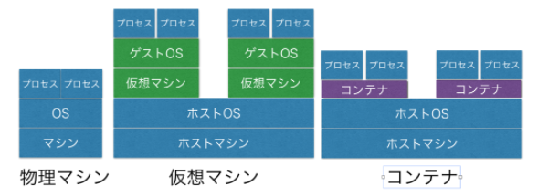
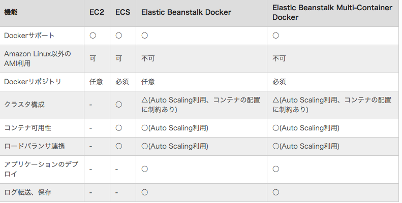
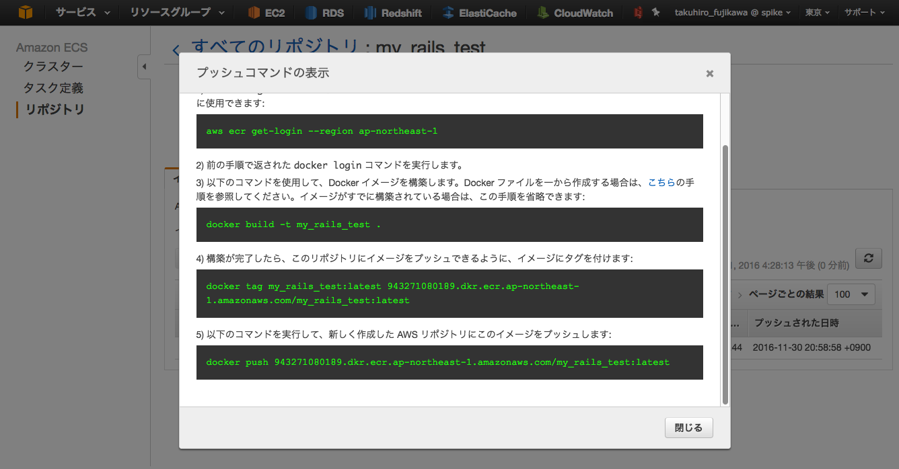
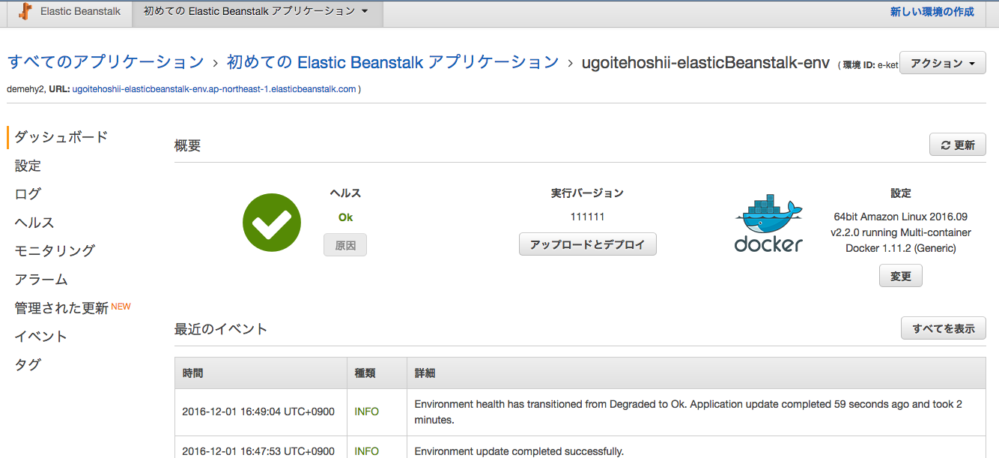

name: inverse
layout: true
class: center, middle, inverse
---
## AWSのBeanstalkのMulti-Container Docker使ってみた

2016/12/09
藤川

---
layout:false
## はじめに

* 申込画面を一人で作っていて、ローカルはDockerで動かしているけど、本番もDockerで運用できないか

* 余談ですが仮想通貨の発表しようと思ったんですけど、こちらの知見の方が需要と実用性がありそうなので、こちらを選択

---
## そもそもDockerとは

* Docker社が提供するオープンソースのコンテナ管理ソフト。ハイパーバイザー型の仮想化とは違い、OSレベルの仮想化を行う。
起動が早くて、CPUやメモリーに優しく、テスト環境構築には有用。Dockerfileなどを記述することで誰がやっても同じ環境を構築できる。immutable infrastructureを実現するツール

* 具体的な使い方はimageをDocker Hubなどからpullしてくるか、buildして作成し、docker runでimageを指定してコンテナを起動させる。Dockerfileでbuildの方法を柔軟に記述できる。  

* docker-compose.ymlにどのDockerfileからbuildするのか、コンテナをどのように起動するかをまとめて記述して、docker-compose upで一発で起動するのが最近の主流

---
## AWSのDockerサービス

* EC2  
頑張ってEC2に自前でDocker入れて運用

* ECS(EC2 Container Service)  
最初からEC2にDocker入ってる。エージェントというものが入っていて、Dockerクラスタが管理されてるマネージドサービス。

* BeanstalkのDocker  
Beanstalkはインスタンスやネットワーク、RDSをまとめて作成してくれる、至れり尽くせりのサービス。これのDocker対応版。内部的にECSが使用されている。ただし一つのインスタンスに単一コンテナ。

* BeanstalkのMulti-Container Docker  
上記BeanstalkのMulti Container版。一つのインスタンスに複数コンテナ持てる。今は単一コンテナしか動かさなくても、
いずれ拡張したくなるかもしれないから上よりはとりあえずこれ使えばいいと思う。今回はこれの紹介

---
こんな感じ  

---
## private imageリポジトリ

* かつてはS3に置いたりして皆頑張ってたみたいだが、最近はAWSにECR(EC2 Container Registry)というサービスが出来たので、これを使うのがよいと思う。  
ちなみにAWSの中にはECRという項目はなく、ECSの中に設定できる箇所がある。普通に迷うw  

* コンソール上でリポジトリ作ると、下図のようにawsコマンドが出るので、それを叩けば簡単にimageをpushできる。s3の料金しかかからない

---
## BeanstalkのMulti-Container Docker

* Beanstalkで新しい環境の作成 ⇒ プラットフォームにMulti-Container Dockerを選択し、ウィザードに従って行けば簡単に作成できる。
ELBやRDS、ネットワークの設定も勝手にやってくれるので、まさに至れり尽くせり

* Deployはなんとファイルアップロードで行う。  
aws独自のDockerrun.aws.jsonというdocker-compose.yml的なファイルをアップロードするのがメインの方法。
Dockerrun.aws.jsonはどのリポジトリのimageをpullするか指定できるので、ここで先程のECRのリポジトリを指定する。  
一台に簡単なRailsのコンテナをdeployするだけでも、2〜5分くらいかかるのでだいぶ遅く感じる。

* 一度にデプロイして速いがダウンタイムが発生するデプロイと、遅いけどでダウンタイムが発生しないローリングデプロイがある

---
RailsのコンテナをBeanstalk Multi-containerで動かしてみた

---
## まとめ

### 良い点
* 敷居は高く、新旧様々な情報が混じっていてわかりにくいが、わかってしまえば意外と簡単で、環境の作成がボタン一発でできる。deployもimageをpushしてDockerrun.aws.jsonをアップするだけで簡単。削除もボタン一発で消してくれるので楽。

* インフラ周りをまるごと変えて、deployするといういわゆるブルーグリーンデプロイはかなりやりやすそう。

* imageとDockerrun.aws.jsonさえ正しければ、全く同じ環境を簡単に作成できる。ポータビリティ感が半端ない

* 小さいサービスやDemo画面をちょろっと作りたい時はとても便利だと思う。消すのも簡単だし、料金もインスタンス代などしかかからない。

---
## まとめ

### 不安点・課題点

* 本番で運用するとなると、世の中的に知見がたまってないので一抹の不安が残る。皆実験中でベストプラクティスがない。  
小さいサービスには向いているが、大規模サービスにはそれほど向いてない印象

* 一人で小さい規模の開発だと問題ないけど、複数で大きい規模の開発だと、この方法だとミスが起こりそうな予感がする。
もし本番を間違って消してしまうと死ぬ＼(^o^)／

* Dockerの中で何が起こっているのかわかりにくい。本番特有の障害がもし起こったら、調査が大変そう。

* assets:precompileを事前に行ってからbuildしたり、コンソールから見ることが出来るlogがわかりづらいのでfluentdを使ったり  
普通に運用するよりも考慮するべきことが増えてしまう気がする。deployも意外と遅い。思ったより優位性があるようでないかも。この辺調査中。

---
## 参考URL

[AWSのBeanstalkのMulti-Container Dockerリファレンス](http://docs.aws.amazon.com/ja_jp/elasticbeanstalk/latest/dg/create_deploy_docker_ecs.html)  

[Elastic Beanstalk の Multi-Container Docker Environment は便利1](https://adtech.cyberagent.io/techblog/archives/865)  

[Elastic Beanstalk の Multi-Container Docker Environment は便利2](https://adtech.cyberagent.io/techblog/archives/913)  

[ECR使ってBeanstalkにデプロイ](http://qiita.com/ytyng/items/84f056260a5ede67a431)  

[本番運用しようと頑張ってる人のqiita](http://qiita.com/joker1007/items/b8a932c1ae29705cef8d)
